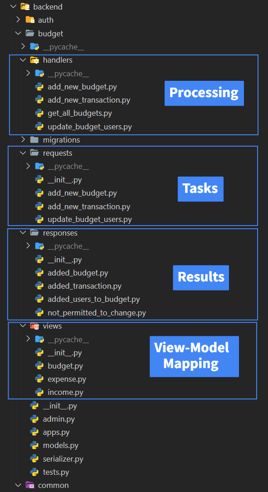

<h1 align="center">FamilyBudget App</h1>
  <h4 align="center"> </h4>
  

    <a href="https://github.com/Luzkan/FamilyBudget#Table-of-Contents" align="center"><strong>Explore the App »</strong></a>
     
    <a href="https://github.com/Luzkan/FamilyBudget/docs/CHANGELOG.md">CHANGELOG.md</a>
    ·
    <a href="https://github.com/Luzkan/FamilyBudget/frontend">Frontend (React/TypeScript)</a>
    ·
    <a href="https://github.com/Luzkan/FamilyBudget/backend">Backend (Django/Python)</a>
  

Hey. 🐈

I didn't have any solo-dev full stack sample app in portfolio, so now I have.

## Table of Contents

- [Features](#features)
- [Managing Project](#managing-project)
- [Database](#database)
- [API Communication](#api-communication)
- [Considerations](#considerations)
  - [Backend Structure Design](#backend-structure-design)
  - [Security](#security)
  - [Database](#database)
  - [Querying](#querying)

---

## 🚀 Features

- [x] Implementation Technologies:
  - ⚒️ Backend:
    - [Python](https://www.python.org/downloads/) 3.10
    - [Django](https://www.djangoproject.com/) 4.0
  - 🖌️ Frontend:
    - [TypeScript](https://www.typescriptlang.org/) 4.6
    - [React](https://pl.reactjs.org/) 17.0
      - [React Redux](https://react-redux.js.org/) 7.2
      - [React Bootstrap](https://react-bootstrap.github.io/) 2.2
    - [Webpack](https://webpack.js.org/) 5.70
- [x] Implementation Design:
  - ⚒️ Backend:
    - "Screaming" Architecture
  - 🖌️ Frontend:
    - Self-Checkout Hierarchy
    - Tiny Components
    - Separation of Concerns
  - 🗒️ Documentation:
    - Medium Commits
    - [Tags](https://github.com/Luzkan/FamilyBudget/tags)
    - [`CHANGELOG.md`](https://github.com/Luzkan/FamilyBudget/blob/main/docs/CHANGELOG.md)
  - 🔧 Dev-Style:
    - Deadline Driven Development
      - _(a pinch of time compared to how much there should be for such a project)_
- [x] REST API Communication
  - ⚒️ Backend:
    - [Django Rest Framework](https://www.django-rest-framework.org/)
  - 🖌️ Frontend:
    - [Axios](https://github.com/axios/axios)
- [x] Dockers containers w/ docker-compose:
  - ⚒️ Backend
  - 🔥 [Celery](https://github.com/celery/celery) (Asynchronous Tasks)
  - 🔥 [RabbitMQ](https://www.rabbitmq.com/) (Message Broken)
  - 🔥 [Mailhog](https://github.com/mailhog/MailHog) (E-Mail Communication)
  - 🖌️ Frontend
  - 🔥 [Redis](https://redis.io/) (Non-Relational Database)
  - 🏢 [Postgresql](https://www.postgresql.org/) (Relational Database)
- [x] Functionality
  - [x] Responsiveness
  - [x] Registration / login
  - [x] Token Authorization
  - [x] Users can create budgets
  - [x] Users can manage users assigned to a given budget
  - [ ] Tests
  - [ ] Pagination
  - [ ] Filtering
  - [ ] Multi-language Support

## 🧑‍🏭 Managing Project

You can manage the project via [shell scripts](./scripts/backend/) (that can be launched on Unix systems or w/ [git bash](https://git-scm.com/downloads) on Windows). These scripts contain some common routines that you might be interested with.

#### 🏗️ **First-time launch:**

- [**`./scripts/clean_start.sh`**](./scripts/clean_start.sh)
  - Run the whole project from scratch. initializes, makes database migrations and starts containers.
- [**`./scripts/initialize.sh`**](./scripts/initialize.sh)
  - Created Docker Volume nad initializes the project _(no-cache)_.
- [**`./scripts/setup.sh`**](./scripts/setup.sh)
  - Builds _Frontend_ and _Backend_

#### 👨‍🔧 **Developing**

- [**`./scripts/migration.sh`**](./scripts/migration.sh)
  - Does the `python manage.py makemigrations` && `python manage.py migrate` on docker container.
- [**`./scripts/rebuild.sh`**](./scripts/rebuild.sh)
  - Same as `clean_start.sh` but w/o Volume creating and using cache.
- [**`./scripts/up.sh`**](./scripts/up.sh)
  - Basically `docker-compose -d up`.

---

## 🏛️ Database

### Models/Interaction Diagram

It's quite simple to understand, refer to this pseudo-uml diagram below containing model, interaction and implementation perspectives.

---

## 📪 API Communication

All the communication is handled by _Services_ (`*.service.ts`), which can be found in the `/frontend/src/services/` directory. Even though this project is made with React framework, this is the idea that I came across when doing some [Angular projects](https://angular.io/guide/architecture-services).

These services can be used by anyone, but in this app everything is exclusively handled by the _State Creators_ - they are placed inside the `/frontend/src/store/`. More on _Action Creators_ in the _react-redux_ [documentation](https://redux.js.org/understanding/thinking-in-redux/glossary#action-creator).

### Headers

Header of each response contains user token, if the user is logged in.

### Endpoints

All endpoints start with `/api/rest/`.

#### [_`auth.service.ts`_](./frontend/src/services/auth.service.ts)

- `/auth/login/` (_post_)
  - Data: `{email: str, password: str}`
  - Logins the user with credentials if registered
  - _handled by: [/backend/auth/handlers/login](./backend/budget/handlers/login.py)_
- `/auth/register/` (_post_)
  - Data `{email: str, password: str}`
  - Registers a new account with given credentials
  - _Note_: Password string confronts `algorithm$salt$iterations$hashed_password`
  - _handled by: [/backend/auth/handlers/register](./backend/budget/handlers/register.py)_
- `/auth/check/` (_post_)
  - Data `{email: str}`
  - Safety-check: is the user holding his own valid token?
  - _handled by: [/backend/auth/handlers/check_authorization](./backend/budget/handlers/check_authorization.py)_

#### [_`budget.service.ts`_](./frontend/src/services/budget.service.ts)

- `/budget/` (_post_)
  - Data: `{name: str, total_budget: int}`
  - Creates a new budget
  - _requires auth token_
  - _handled by: [/backend/budget/handlers/add_new_budget](./backend/budget/handlers/add_new_budget.py)_
- `/budget/users` (_post_)
  - Data: `{budget_id: str, users: list[{id: int, email: str}]}`
  - Updates the given budget with a new user list.
  - _requires auth token_
  - _handled by: [/backend/budget/handlers/update_budget_users](./backend/budget/handlers/update_budget_users.py)_
- `/budget/all` (_get_)
  - Gets all budgets of currently logged in user.
  - _requires auth token_
  - _handled by: [/backend/budget/handlers/get_all_budgets](./backend/budget/handlers/get_all_budgets.py)_

#### [_`transaction.service.ts`_](./frontend/src/services/transaction.service.ts)

- `/budget/expense` (_post_)

  - Data: `{budget_id: int, name: str, amount: int, category: str}`
  - Creates a new Expense item for given budget.
  - _requires auth token_
  - _handled by: [/backend/budget/handlers/add_new_transaction](./backend/budget/handlers/add_new_transaction.py)_

- `/budget/income` (_post_)
  - Data: `{budget_id: int, name: str, amount: int, category: str}`
  - Creates a new Income item for given budget.
  - _requires auth token_
  - _handled by: [/backend/budget/handlers/add_new_transaction](./backend/budget/handlers/add_new_transaction.py)_

#### [_`users.service.ts`_](./frontend/src/services/transaction.service.ts)

- `/users/all/` (_get_)
  - Queries all users from database.
  - _requires auth token_
  - _handled by: [/backend/users/handlers/get_all_users](./backend/users/handlers/get_all_users.py)_

---

## 📇 Considerations

### 🗂️ Backend Structure Design

Aka. _Views vs ViewSets_: inter-app backend structure design.

- At first I went with the `ViewSets` but with only a single one `View` inside of it - it was just for the ease of switching after making the final decision whether I would like the first or latter option.
- I'm highly favouring architecture which _screams_ the available use cases - it's just a good design principle.
- After all, I've created a `RequestManagers` called `Handlers`, and those have own separate directory inside of each Django App, that can inform about the possible use-cases from the perspective of file hierarchy. This allows me to get the benefits of abstracting `Views` into `ViewSets` (commonized base paths or authentifications/other stuff that Django gives in its features).
- It's all debatable though, but that is just my take on that. Here's the structure explanation

### 🕌 Security

- I would advocate to **never** send password in plaintext via API, even when SSL is used. The best solution would be to generate an unique [salt](<https://en.wikipedia.org/wiki/Salt_(cryptography)>) on client side, store it in database, and then perform proper encryption before sending a request with password. More good practices on REST API Communication [here](https://cheatsheetseries.owasp.org/cheatsheets/REST_Security_Cheat_Sheet.html).
- The very same issue is with the Token authorization that I've implemented - it is **not** safe, especially because I keep it in [localStorage](https://developer.mozilla.org/pl/docs/Web/API/Window/localStorage). I would suggest changing the implementation from the Django token (about which I don't know, much and thus I definitely don't trust the mechanism) to something that has viable reputation like the [JWT Tokens](https://jwt.io/). The very best solution would be to handle authentication by 3rd party that know what is doing.
- Currently the passwords are encrypted via random salt and sha-256. This is **not** safe. Preferably use the [AES](https://pl.wikipedia.org/wiki/Advanced_Encryption_Standard) or [RSA](<https://en.wikipedia.org/wiki/RSA_(cryptosystem)>). Generally, if this `README.md` is already "dated" compared to the time you are reading this, refer to [OWASP](https://owasp.org/) for newest cybersecurity recommendations ([password cheatsheet](https://cheatsheetseries.owasp.org/cheatsheets/Password_Storage_Cheat_Sheet.html)).

### 📈 Database

- Budget-User optimizations:
  - Each `user` can have `(0..*)` items of `budget`
  - Each `budget` can have `(1..*)` items of `user`
  - At this moment, when a user queries for his `budgets`, it is solved by the reverse query functionality built in Django.
  - I never had the chance to benchmark how does Django handle this situation, but depending on the most frequent use case scenario _(`select` for sure)_, there could be other solutions, like a new _Model_ with columns for foreign keys of `User` and `Budget` or giving `User` an extra column containing `Budgets`.
    - If the underline implementation handles the situation like `Budget.objects.filter(users=user.id)` in disguise, then there are for sure better solutions in large scale system. If there is a new table containing two columns for primary keys, then maybe it's fine. I can just guess how Django handles the many-to-many relations and I'm under super-heavy deadline.

### 💼 Querying

- Lot's of stuff is doing on behalves of currently logged in users. A ready-made solution for such tasks would be great. There is a [django-crum](https://pypi.org/project/django-crum/) library that contains built-in tests, safe-checks and implementation, but unfortunately is not supported for Django 4.0.
