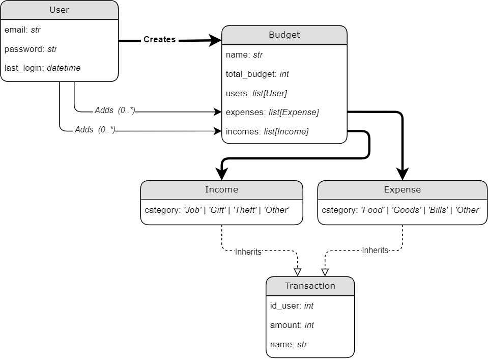

# FamilyBudget App

TBA. 🐈

---

### Managing Project

You can manage the project via shell scripts (that can be launched on Unix systems or w/ [git bash](https://git-scm.com/downloads) on Windows). These scripts contain some common routines that you might be interested with.

#### **First-time launch:**

- [**`./scripts/clean_start.sh`**](./scripts/clean_start.sh)
    - Run the whole project from scratch. initializes, makes database migrations and starts containers.
- [`./scripts/initialize.sh`](./scripts/initialize.sh)
    - Created Docker Volume nad initializes the project _(no-cache)_.
- [`./scripts/setup.sh`](./scripts/setup.sh)
    - Builds _Frontend_ and _Backend_
    
#### **Developing**

- [`./scripts/migration.sh`](./scripts/migration.sh)
- [`./scripts/rebuild.sh`](./scripts/rebuild.sh)
- [`./scripts/up.sh`](./scripts/up.sh)

### Database Models/Interaction Diagram:

### Endpoints:

- `rest/api/auth/login/` (_post_)
- `rest/api/auth/register/` (_post_)
- `rest/api/auth/check/` (_post_)
- `rest/api/budget/all` (_get_)
- `rest/api/budget/` (_post_)

## Considerations:

### Security

- I would advocate to **never** send password in plaintext via API, even when SSL is used. The best solution would be to generate an unique [salt](https://en.wikipedia.org/wiki/Salt_(cryptography)) on client side, store it in database, and then perform proper encryption before sending a request with password. More good practices on REST API Communication [here](https://cheatsheetseries.owasp.org/cheatsheets/REST_Security_Cheat_Sheet.html).
- The very same issue is with the Token authorization that I've implemented - it is **not** safe, especially because I keep it in [localStorage](https://developer.mozilla.org/pl/docs/Web/API/Window/localStorage). I would suggest changing the implementation from the Django token (about which I don't know, much and thus I definitely don't trust the mechanism) to something that has viable reputation like the [JWT Tokens](https://jwt.io/). The very best solution would be to handle authentication by 3rd party that know what is doing.
- Currently the passwords are encrypted via random salt and sha-256. This is **not** safe. Preferably use the [AES](https://pl.wikipedia.org/wiki/Advanced_Encryption_Standard) or [RSA](https://en.wikipedia.org/wiki/RSA_(cryptosystem)). Generally, if this `README.md` is already "dated" compared to the time you are reading this, refer to [OWASP](https://owasp.org/) for newest cybersecurity recommendations ([password cheatsheet](https://cheatsheetseries.owasp.org/cheatsheets/Password_Storage_Cheat_Sheet.html)).

### Querying

- Lot's of stuff is doing on behalves of currently logged in users. A ready-made solution for such tasks would be great. Here is a [django-crum](https://pypi.org/project/django-crum/) library that contains built-in tests, safe-checks and implementation, but unfortunately is not supported for Django 4.0.

### Database

- Budget-User optimizations:
    - Each `user` can have `(0..*)` items of `budget`
    - Each `budget` can have `(1..*)` items of `user`
    - At this moment, when a user queries for his `budgets`, it is solved by `Budget.objects.filter(users=user.id)`
    - I never had the chance to benchmark how does Django handle this situation, but depending on the most frequent use case scenario _(`select` for sure)_, there could be other solutions, like a new _Model_ with columns for foreign keys of `User` and `Budget` or giving `User` an extra column containing `Budgets`.
