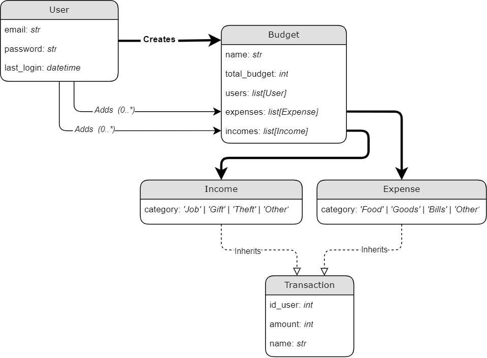

# Changelog

All notable changes to this project will be documented in this file.

The format is based on [Keep a Changelog](https://keepachangelog.com/en/1.0.0/),
and this project adheres to [Semantic Versioning](https://semver.org/spec/v2.0.0.html).

---

## [[0.1.1]] - 2022-03-23

###### _([diff: 0.1.0-0.1.1])_

### Added

-   Created database [models](../backend/users/models.py)
    -   `User`
    -   `Budget`
    -   `Expense` _(type of `Transaction`)_
    -   `Income` _(type of `Transaction`)_
    -   `Transaction`
-   Created Simple UML Model, though [draw.io](https://app.diagrams.net/), available [here](./models/database.drawio)
    

## [[0.1.0]] - 2022-03-23

###### _([diff: 0.0.0-0.1.0])_

**Frontend Dependencies & Packages.**

Connected Frontend & Backend via webpack_loader.

### Added:

-   React
-   Bootstrap
-   Redux
-   Lodash
-   Axios/Cookie
-   Prepared [`./frontend/sass`](../frontend/sass/) directory:
    -   `/sass/global/` for globally used styling
    -   `/sass/components/` for common components
    -   `/sass/pages/` for specific pages
    -   `/sass/vendor/` for bootstrap

## [[0.0.0]] - 2022-03-23

**Project was initialized.**

-   Structure:
    -   [`/backend/`](../backend)
        -   Based on boilerplate template, w/ my migrations:
            -   Python~=`3.8` -> [Python~=`3.10`](https://www.python.org/downloads/)
            -   Django~=`3` -> [Django](https://www.djangoproject.com/)~=`4.0`
        -   [Django Rest Framework](https://www.djangoproject.com/)~=`3.13.1`
        -   [Celery](https://github.com/celery/celery)
    -   [`/frontend/`](../frontend)
        -   Generated using Webpack CLI
        -   [TypeScript](https://www.typescriptlang.org/)
        -   [SASS](https://sass-lang.com/)
    -   [`/scripts/`](../scripts)
        -   Shell Files (executable on Windows via [Git Bash](https://gitforwindows.org/))
        -   Executing via [Docker](https://www.docker.com/)
    -   [`/docs/`](../docs)
        -   [CHANGELOG.md](./CHANGELOG.md) based on [keep a changelog](https://keepachangelog.com/en/1.0.0/)
    -   [`.`](./)
        -   Linters:
            -   Prettier (_frontend_)
            -   Black (_backend_)
            -   Pylint (_backend_)
            -   PEP8 (_backend_)
        -   Safety Checkers:
            -   Bandit (_backend_)
-   Pipelines:
    -   I know I should implement them right away and have all of that sort of things already done, but I _really_ want to start some dev coding 🐈
    -   ... still got to setup frontend-backend, so I'll prioritize that at this moment.

[diff: 0.1.0-0.1.1]: https://github.com/Luzkan/FamilyBudget/compare/0.1.0...0.1.1
[diff: 0.0.0-0.1.0]: https://github.com/Luzkan/FamilyBudget/compare/0.0.0...0.1.0
[0.1.1]: https://github.com/Luzkan/FamilyBudget/releases/tag/0.1.1
[0.1.0]: https://github.com/Luzkan/FamilyBudget/releases/tag/0.1.0
[0.0.0]: https://github.com/Luzkan/FamilyBudget/releases/tag/0.0.0
